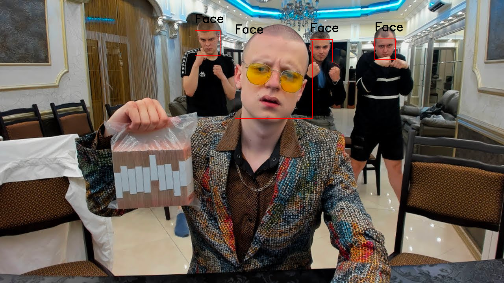

<h1>Face Detection with OpenCV</h1>

<h4>Very simple tool for face detection on Image or Video</h4>

<h2>Services</h2>
<ul> 
<li>
<h3><b>ImageDetection</b></h3>
<ul>
<li>
<b>Instance Methods</b>
<ul>
<li>
    .show() show of detection result on window (<b>with your params</b>)
</li>
<li>
    .detect() write new file with detected faces (<b>with your params</b>)
</li>
</ul>
</li>
<li>
<b>Instance Attributes</b>
<ul> 
<li> 
<b>path</b>: path to file (.png, .jpeg, .jpg, ...) <i>REQUIRED</i>
</li>
<li>
<b>scale_factor</b>: (Read the OpenCV docs) <i>REQUIRED</i>
</li>
<li>
<b>min_neighbors</b>: (Read the OpenCV docs) <i>REQUIRED</i>
</li>
<li>
<b>rect_color</b>: color of rectangle (detected objects) must be tuple (B, G, R)
</li>
<li>
<b>text</b>: title of detected objects
</li>
<li>
<b>text_color</b>: color of text (detected objects) must be tuple (B, G, R)
</li>
<li>
<b>show_title</b>: title of detected objects window
</li>
<li>
<b>delay</b>: cv2.waitKey(delay)
</li>
<li>
<b>output_path</b>: if you call .detect() method, you must set result file path
</li>
</ul>
</li>
</ul>
<li>
<h3><b>VideoDetection</b></h3>
<ul>
<li>
<b>Instance Methods</b>
<ul>
<li>
    .show() show of detection result on window (<b>with your params</b>)
</li>
<li>
    .detect() write new video with detected faces (<b>with your params</b>)
</li>
</ul>
</li>
<li>
<b>Instance Attributes</b>
<ul> 
<li> 
<b>src</b>: path to video or index of camera <i>REQUIRED</i>
</li>
<li>
<b>scale_factor</b>: (Read the OpenCV docs) <i>REQUIRED</i>
</li>
<li>
<b>min_neighbors</b>: (Read the OpenCV docs) <i>REQUIRED</i>
</li>
<li>
<b>rect_color</b>: color of rectangle (detected objects) must be tuple (B, G, R)
</li>
<li>
<b>rect_thickness</b>: rectangle thickness must be integer
</li>
<li>
<b>text</b>: title of detected objects
</li>
<li>
<b>text_color</b>: color of text (detected objects) must be tuple (B, G, R)
</li>
<li>
<b>show_title</b>: title of detected objects window
</li>
<li>
<b>delay</b>: cv2.waitKey(delay)
</li>
<li>
<b>fourcc</b>: format of saving video with detected objects, default=mp4v for .mp4 files use with cv2.VideoWriter (PS: read the OpenCV docs)
</li>
<li>
<b>output_path</b>: if you call .detect() method, you must set result file path
</li>
</ul>
</li>
</ul>

</li>
</ul>

<h2>Examples</h2>
<ul>
<li>
<h3><b>ImageDetection</b></h3>
<ul>
<li><b>.detect()</b></li>
<li><b>Before Face Detection image</b></li>

<li><b>After Face Detection image</b></li>

</ul>
</li>
<li>
<h3><b>VideoDetection</b></h3>
<ul>
<li><b>.detect()</b></li>
<li><b>Before Face Detection video</b></li>

<li><b>After Face Detection video</b></li>

</ul>
</li>
</ul>